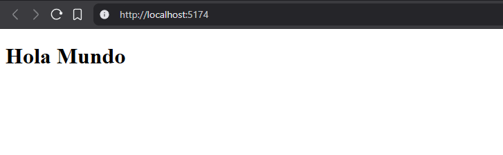
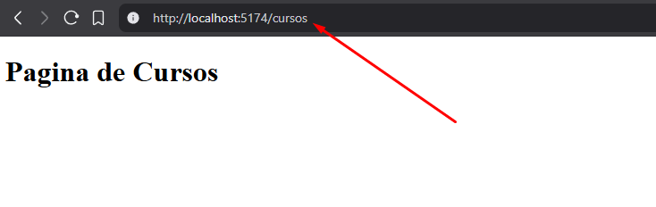
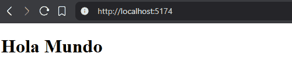
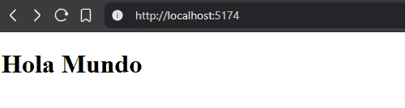
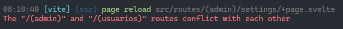
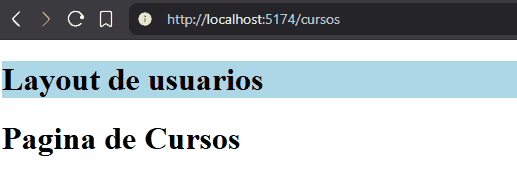
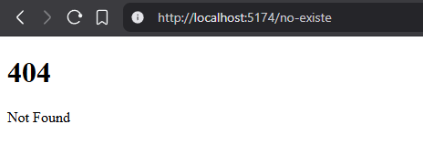
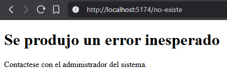

---
# You can also start simply with 'default'
theme: seriph
# random image from a curated Unsplash collection by Anthony
# like them? see https://unsplash.com/collections/94734566/slidev
background: https://cover.sli.dev
# some information about your slides (markdown enabled)
title: Svelte Routing
author: Nicolás Villamonte
info: |
  ## Introducción a Svelte Routing
  Curso de Algoritmos y Programación III - UNSAM
# apply unocss classes to the current slide
class: text-center
# https://sli.dev/features/drawing
drawings:
  persist: false
# slide transition: https://sli.dev/guide/animations.html#slide-transitions
transition: slide-left
# enable MDC Syntax: https://sli.dev/features/mdc
mdc: true
# open graph
seoMeta:
  # By default, Slidev will use ./og-image.png if it exists,
  # or generate one from the first slide if not found.
  ogImage: auto
  # ogImage: https://cover.sli.dev
hideInToc: true
---

# Svelte Routing

<div class="abs-br m-6 text-xl">
  <a href="https://svelte.dev/docs/kit/routing" target="_blank" class="slidev-icon-btn">
    <carbon:logo-svelte/>
  </a>
</div>

---
transition: fade-out
hideInToc: true
---

# Indice

<Toc minDepth={1} maxDepth={2} />

---
transition: slide-left
---

# Ruteo Simple

<div class="pr-8 max-w-prose space-y-3">
  <ul class="list-disc pl-6 text-md leading-relaxed">
    <li>El ruteo en Sveltekit es basado en archivos.</li>
    <li v-click="1" v-motion
    :initial="{ opacity: 0, x: -12 }"
    :enter="{ opacity: 1, x: 0 }"><code>src/routes</code> es la ruta raíz.</li>
    <li v-click="2" v-motion
    :initial="{ opacity: 0, x: -12 }"
    :enter="{ opacity: 1, x: 0 }">Los archivos <code>+page.svelte</code> contienen el código de la página.</li>
    <li v-click="3" v-motion
    :initial="{ opacity: 0, x: -12 }"
    :enter="{ opacity: 1, x: 0 }">Para rutas anidadas, creá carpetas con sus <code>+page.svelte</code>.</li>
  </ul>
</div>

<br/>


<div class="pl-8 w-full" v-click="1">
  <div class="rounded-xl shadow-xl p-4 bg-white/5">
```text {0|1-2|2,4|2,5-6}
src/
  routes/
  ├─ +layout.svelte
  ├─ +page.svelte                    # /
  └─ cursos/
     └─ +page.svelte                 # /cursos
```
</div> 

<b v-click="2"> URL: </b>
<div class="mt-6 text-lg font-mono tracking-wide">
  <template v-if="$clicks >= 2 && $clicks < 3">
    http://localhost:5173
  </template>
  <template v-if="$clicks >= 3">
    http://localhost:5173/cursos
  </template>
</div>
</div>


---
transition: slide-left
---

## Archivo `+page.svelte`


```vue {monaco}
<script lang="ts">
  // Logica de la página
</script>

<h1>Hola Mundo</h1>
```

<div class="w-full flex justify-center">
  
</div>

---
transition: slide-left
---

## Archivo `+page.svelte` en una subcarpeta


Si creamos una carpeta `cursos` dentro de `routes` debemos agregar un nuevo archivo `+page.svelte` dentro de esa carpeta, esa será la página que se renderice al acceder a `/cursos`.

```text {5-6}
src/
  routes/
  ├─ +layout.svelte
  ├─ +page.svelte                    # /
  └─ cursos/
     └─ +page.svelte                 # /cursos
```

<div class="w-full flex justify-center">
  
</div>


---
transition: slide-left
---

## Archivo `+layout.svelte`

El archivo `+layout.svelte` es un componente que envuelve a todas las páginas hijas. Es útil para definir una estructura común, como un encabezado o pie de página.

<div v-click="1">
En este caso el archivo `+layout.svelte` va a aplicar a todas las páginas dentro de `routes`, es decir a `/` y a `/cursos`.
</div>


```text {3|3,4,6}
src/
  routes/
  ├─ +layout.svelte
  ├─ +page.svelte                    # /
  └─ cursos/
     └─ +page.svelte                 # /cursos
```

<div v-click="2" class="mt-10 color-gray" v-motion
    :initial="{ opacity: 0, x: -12 }"
    :enter="{ opacity: 1, x: 0 }">
Todos los directorios dentro de <code>routes</code> pueden tener su propio <code>+layout.svelte</code> que aplicará a todas las páginas hijas de ese directorio.

```text {2-3}
...
cursos/
  ├─ +layout.svelte
  └─ +page.svelte                 # /cursos
```
</div>

---
transition: slide-left
---

### Ejemplo de layout

Una vez que se crea el archivo `+layout.svelte`, la página que se renderiza por defecto es la del layout, por lo que es necesario invocar a la página hija:

```vue {monaco}
<!-- src/routes/+layout.svelte -->
<script lang="ts">
  // ...
</script>

<header>
  <!-- Codigo del header -->
</header>

<slot />  <!-- ¿Esto está bien? -->
```


<div class=" mt-6" v-click="1">
<b>Slot</b> es una característica de Svelte <span class="text-red-400">deprecada</span>, que sigue funcionando pero no se recomienda su uso en nuevos proyectos. En su lugar, se puede utilizar la sintaxis de <span class="text-green-400">props</span> para pasar componentes hijos y renderizarlo dentro del componente padre.
</div>

---
transition: slide-left
---

### Doble Layout

<script setup>
import { ref } from 'vue'
const answer = ref('')
</script>

Ahora, que pasará en la ruta `/cursos` si agregamos un archivo `+layout.svelte` en su carpeta?

```text {3,5-6}
src/
  routes/
  ├─ +layout.svelte
  ├─ +page.svelte                    # /
  └─ cursos/
     ├─ +layout.svelte
     └─ +page.svelte                 # /cursos
```


<form class="space-y-3 mt-10">
  <label class="block">
    <input type="radio" v-model="answer" value="a" />
    Se va a pisar el Layout de la raíz por el nuevo Layout
  </label>
  <label class="block">
    <input type="radio" v-model="answer" value="b" />
    Se van a renderizar ambos Layouts, el de la raíz y el nuevo Layout
  </label>
  <label class="block">
    <input type="radio" v-model="answer" value="c" />
    Solo se va a renderizar el Layout de la raíz
  </label>
</form>

<div class="mt-6">
  <div v-if="answer === 'a'" class="text-red-400 font-bold">
    ❌ Incorrecto, el Layout raíz no se pisa.
  </div>
  <div v-else-if="answer === 'b'" class="text-green-400 font-bold">
    ✅ Correcto: se renderizan ambos Layouts.
  </div>
  <div v-else-if="answer === 'c'" class="text-red-400 font-bold">
    ❌ Incorrecto, el Layout raíz siempre se combina con el nuevo.
  </div>
</div>


---
transition: slide-left
---

# Ruteo Dinámico

El ruteo dinámico permite crear rutas que aceptan parámetros variables. Esto se logra utilizando corchetes en los nombres de los archivos o carpetas dentro de `src/routes`.

```text {5-6}
src/
  routes/
  ├─ +layout.svelte
  ├─ +page.svelte                    # /
  └─ cursos/
     ├─ [id]/
     │  └─ +page.svelte              # /cursos/:id
     └─ +page.svelte                 # /cursos
```

Esto permite que la ruta `/cursos/:id` pueda manejar diferentes valores para `id`, como: 

- `/cursos/1`
- `/cursos/2`
- `/cursos/abc`
- `/cursos/pepita`


---
transition: slide-left
---

## Obtención de Parámetros

Para obtener el valor del parámetro en la página, se puede utilizar la función `page` del módulo `$app/stores`.

```vue {monaco}
<script lang="ts">
  import { page } from '$app/state';
</script>

<h1>Curso ID: {$page.params.id}</h1>
```

<div class="w-full flex justify-center">
  
</div>


---
transition: slide-left
---

# Grupos de Rutas

Los grupos de rutas permiten organizar las rutas sin afectar la estructura de las URLs. Se crean utilizando paréntesis en los nombres de las carpetas.

```text {3,10|10-12}
src/
  routes/
  ├─ (usuarios)/
  │ ├─ +layout.svelte
  │ ├─ +page.svelte                    # /
  │ └─ cursos/
  │   ├─ [id]/
  │   │  └─ +page.svelte              # /cursos/:id
  │   └─ +page.svelte                 # /cursos
  └─ (admin)/
    └─ settings/
        └─ +page.svelte                 # /settings
```

<div class="w-full flex justify-center" v-click="1">
  
</div>

---
transition: slide-left
---

## Rutas Duplicadas

<script setup>
import { ref } from 'vue'
const answer = ref('')
</script>

¿Qué pasaría en este caso?


```text {3-6}
src/
  routes/
  ├─ (usuarios)/
  │ └─ +page.svelte
  └─ (admin)/
    └─ +page.svelte
```

<form class="space-y-3 mt-10">
  <label class="block">
    <input type="radio" v-model="answer" value="a" />
    Va a arrojar un error de conflicto de rutas.
  </label>
  <label class="block">
    <input type="radio" v-model="answer" value="b" />
    Se va a pisar el <code>+page.server</code> primer grupo por el segundo.
  </label>
  <label class="block">
    <input type="radio" v-model="answer" value="c" />
    Va a darle más prioridad al grupo que esté primero en el árbol de archivos.
  </label>
</form>

<div class="mt-6">
  <div v-if="answer === 'a'" class="text-green-400 font-bold">
    <div>✅ Correcto, hay un conflicto de rutas.</div>
    <div class="w-full flex justify-center">
      
    </div>
  </div>
  <div v-else-if="answer === 'b'" class="text-red-400 font-bold">
    ❌ Incorrecto, no sucede como en CSS.
  </div>
  <div v-else-if="answer === 'c'" class="text-red-400 font-bold">
    ❌ Incorrecto, el orden no importa ya que generalmente se ordena alfabéticamente y nos daría poco control.
  </div>
</div>

---
transition: slide-left
---

## Layout duplicados

Los layouts se pueden duplicar en diferentes grupos de rutas sin problemas. Por ejemplo:

```text {4,8|4-6,8-10}
src/
  routes/
  ├─ (usuarios)/
  │ ├─ +layout.svelte
  │ └─ cursos/
  │    └─ +page.svelte             # /cursos
  └─ (admin)/
    ├─ +layout.svelte
    └─ configuracion/
       └─ +page.svelte             # /configuracion
```

Esto permite que cada grupo de rutas tenga su propio layout sin interferir entre sí.

<div class="w-full flex justify-center" v-click="1">
  
</div>

---
transition: slide-left
---

# Bonus: Errores

Por defecto, si se accede a una ruta que no existe, SvelteKit mostrará una página de error genérica.

<div class="w-full flex justify-center">
  
</div>

<div v-click="1" class="mt-6" v-motion
    :initial="{ opacity: 0, x: -12 }"
    :enter="{ opacity: 1, x: 0 }">
A veces vamos a querer personalizar esta página de error para que se ajuste al estilo de nuestra aplicación o para proporcionar información más útil a los usuarios.
</div>

---
layout: two-cols
transition: slide-left
layoutClass: gap-8
---
  
## Archivo `+error.svelte`

El archivo `+error.svelte` permite personalizar la página de error para todas las rutas dentro de su carpeta y subcarpetas.

```text {3}
src/
  routes/
  ├─ +error.svelte
  ├─ +layout.svelte
  ├─ +page.svelte                    # /
  └─ cursos/
      └─ +page.svelte                 # /cursos
```

`+error.svelte`:
```vue {monaco}
<h1>Se produjo un error inesperado</h1>
<p>Contactese con el administrador del sistema.</p>
```

::right::

<div class="w-full h-full flex items-center justify-center" v-click="1" v-motion
:initial="{ y: -120, opacity: 0 }"
:enter="{ y: 0, opacity: 1, transition: { duration: 700, easing: 'ease-out' } }">
  
</div>

---
transition: slide-left
hideInToc: true
---

## Archivo `+error.svelte`

Si se crea un archivo `+error.svelte` en una subcarpeta, este manejará los errores solo para las rutas dentro de esa carpeta.

```text {7}
src/
  routes/
  ├─ +error.svelte
  ├─ +layout.svelte
  ├─ +page.svelte                    # /
  └─ cursos/
    ├─ +error.svelte
    └─ +page.svelte                 # /cursos
```

<v-click>

Además, se puede obtener información del error de la siguiente manera:

```vue {monaco}
<script lang="ts">
  import { page } from '$app/state';
</script>

<h1>Error: {page.status}</h1>
<p>{page.error?.message}</p>
```

</v-click>

---
layout: center
transition: slide-left
class: text-center
hideInToc: true
---

# Ejemplo
 
## Cursos

---
layout: center
transition: slide-left
class: flex items-center justify-center text-center
hideInToc: true
---

# Gracias!
